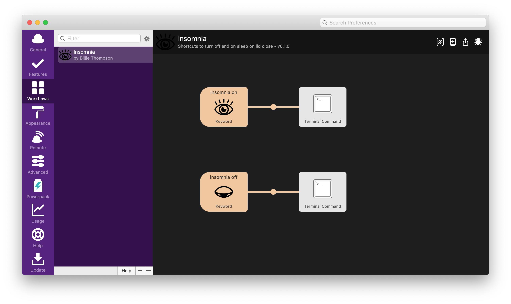

# Alfred Insomnia Workflow

An alfred workflow to recreate what I used to use InsomniaX for.

### Prerequisites

  - [Alfred](https://www.alfredapp.com/)

### Installing

Download the for [Insomnia.alfredworkflow](Insomnia.alfredworkflow) and
open it with Alfred.

## Contributing

Please read [CONTRIBUTING.md](CONTRIBUTING.md) for details on our code
of conduct, and the process for submitting pull requests to us.

## Versioning

We use [SemVer](http://semver.org/) for versioning. For the versions
available, see the [tags on this
repository](https://github.com/PurpleBooth/insomnia-workflow/tags).

## Authors

  - **Billie Thompson** - *Provided README Template* -
    [PurpleBooth](https://github.com/PurpleBooth)

See also the list of
[contributors](https://github.com/PurpleBooth/a-good-readme-template/contributors)
who participated in this project.

## License

This project is licensed under the [The Unlicense](LICENSE.md) a license that dedicates code to the public domain - see the
[LICENSE.md](LICENSE.md) file for details
